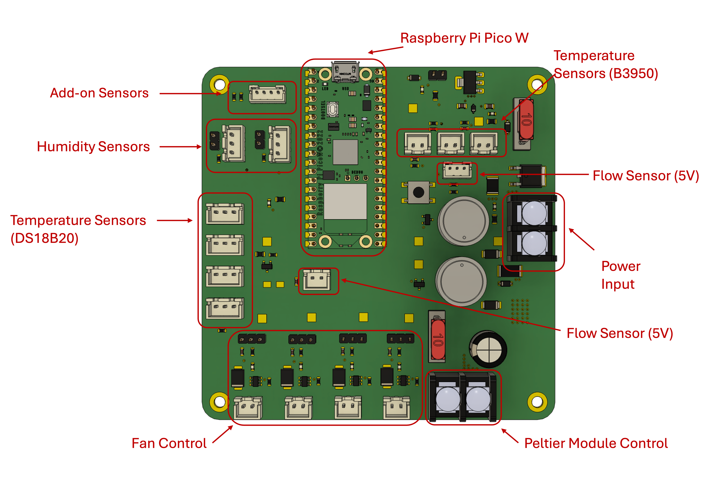

+++
title = "Soldering PCB Components Task"
weight = 2
+++

This task will require you to hand-solder a number of components onto a PCB, simulating the process of building a design called LoopOne.

## LoopOne
LoopOne is an open-source design that aims to alleviate thermal discomfort among wheelchair users. It works by circulating water through a tube in the wheelchair’s cushion for a cooling or heating effect which the user can control as required. In addition to improving the user's comfort, thermally regulating the seat temperature can minimise the risk of pressure sores.

I've designed a custom circuit board (PCB) which handles all necessary functions for this design:
 - Heating and cooling the water (this is done through a small component called a Peltier module)
 - Circulating the water (this is done through a water pump)
 - Sensing water flow (this is a safety measure to ensure any bends in the tube do not increase pressure and put unnecessary strain on the water pump)
 - Sensing temperature and humidity (this allows us to monitor multiple points for pressure and humidity, which in turn allows the user to set up custom settings to suit their needs)
 - Connecting fans (this is an optional add-on where users can choose to add air fans to either blow air through the cushion or toward the user in hot/humid weather)
 - Connecting additional sensors (this takes the form of an I2C port, which DIY-minded users can use to to incorporate additional sensors of choice)

 
 
## Why do I need to solder?
In the spirit of keeping this design as financially accessible as possible, we are testing whether it would be possible for those with 'making' skills to hand-solder larger components to a PCB themselves. This results in a significantly lower cost compared to purchasing a PCB with all required components pre-assembled by the manufacturer.