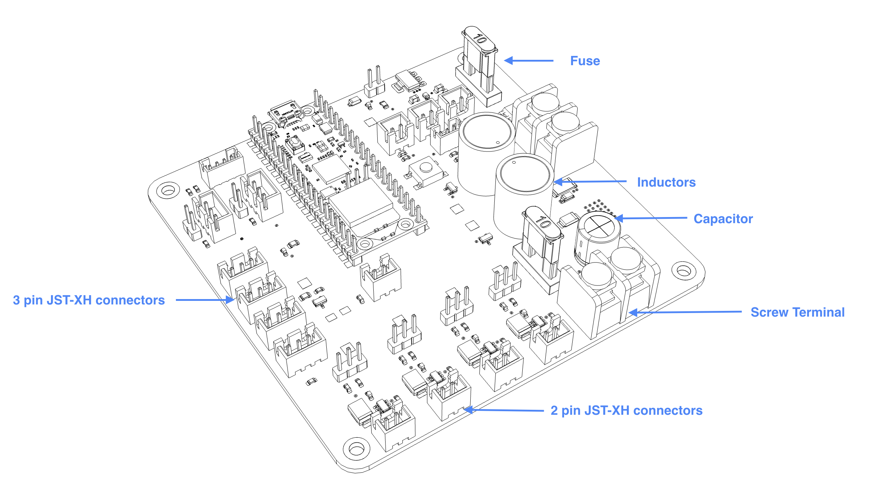

+++
title = "Soldering the PCB"
weight = 1
+++

Have you done the required reading? It's [here](/makers-workshop/soldering/soldering-learning/_index.md)

## Tools and Parts Needed:
- Soldering Iron
- Soldering Wire
- Tip Cleaner
- Flux
- Tinner
- PCB
- Screw Terminal (black, 2-pin)
- Inductor (grey cylinder, 2-pin)
- JST-XH connectors
- Soldering helper (choose from 3D printed jig, masking tape, or "helping hands")

---

## Soldering Task Instructions:

1. Assemble the tools and components needed for soldering  
2. Prepare PCB for soldering with soldering setup of choice. 
3. Affix the screw terminal on the PCB with a “helping hand” or with some masking tape. Be mindful of its orientation.
{} If you are using the 3D printed soldering jig, you want to start with the shortest component we will be soldering today, the JST-XH connectors. {}
4. Verify the orientation and solder the component to the PCB.
5. Now try to solder more components.